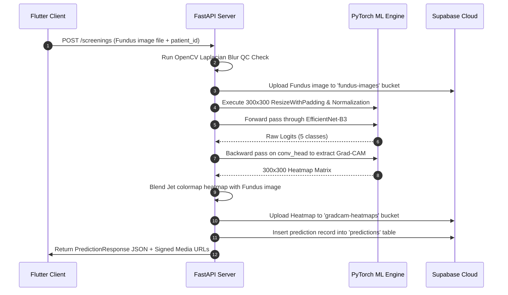

# NETRAVA — Shared Data Flow & Integration Contracts

**Document Version:** 1.0.0  
**Authority:** Agent 00 (Coordinator) & Agent 07 (Documentation Engineer)

---

## 1. Cross-System Data Flow

```mermaid
sequenceDiagram
    autonumber
    participant Client as Flutter Client
    participant Server as FastAPI Server
    participant Model as PyTorch ML Engine
    participant DB as Supabase Cloud

    Client->>Server: POST /screenings (Fundus image file + patient_id)
    Server->>Server: Run OpenCV Laplacian Blur QC Check
    Server->>DB: Upload Fundus image to 'fundus-images' bucket
    Server->>Model: Execute 300x300 ResizeWithPadding & Normalization
    Server->>Model: Forward pass through EfficientNet-B3
    Model-->>Server: Raw Logits (5 classes)
    Server->>Model: Backward pass on conv_head to extract Grad-CAM
    Model-->>Server: 300x300 Heatmap Matrix
    Server->>Server: Blend Jet colormap heatmap with Fundus image
    Server->>DB: Upload Heatmap to 'gradcam-heatmaps' bucket
    Server->>DB: Insert prediction record into 'predictions' table
    Server->>Client: Return PredictionResponse JSON + Signed Media URLs
```

